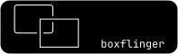
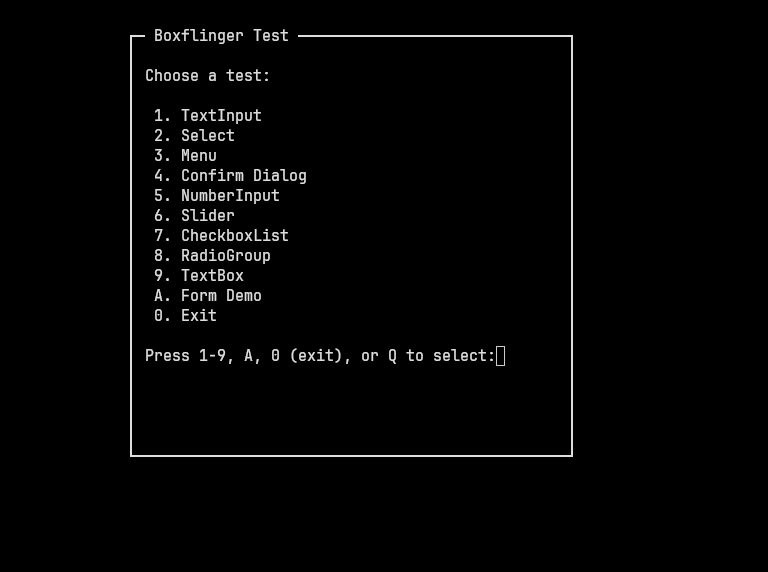
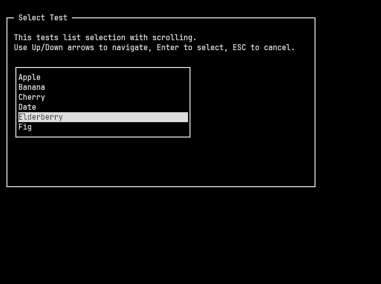
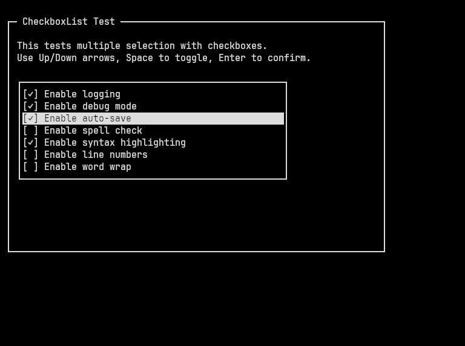
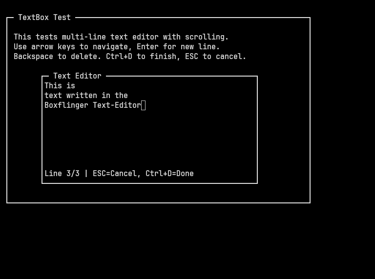

<p align="left">
  
</p>

# Boxflinger

A simple terminal UI library for [ChipLang](https://codeberg.org/ideumi/chip-go).

## Features

- **Widgets**: Text input, number input, multi-line editor, menus, lists, radio buttons, checkboxes, sliders, confirm dialogs
- **Drawing**: Boxes, frames, lines, progress bars, buttons
- **Text**: Clipping, padding, wrapping, alignment
- **Layout**: Proportional horizontal / vertical splitting
- **Graphics**: Image display via the [Kitty Graphics Protocol](https://sw.kovidgoyal.net/kitty/graphics-protocol/)

## Screenshots

<p align="left">
  
  
</p>

<p align="left">
  
  
</p>

## Installation

Build the library:

```bash
mkdir out
chippy combine
```

The `out/libboxflinger.chh` bundle can then be loaded in your programs. Combine will resolve any dependencies that boxflinger needs from the corelib automatically at combine time.

## Documentation

Use `chippy doc` to view full documentation:

```bash
chippy doc libboxflinger.chh                                          # List all symbols
chippy doc libboxflinger.chh "BFMenu(x, y, items, defaultIndex)"      # Show documentation for BFMenu
chippy doc libboxflinger.chh all                                      # Show documentation for all symbols
```

## Demo

Try the interactive demo:

```bash
cd demo/bftest
mkdir out
chippy combine
./out/bftest
```

## License

Boxflinger is licensed under the 2-Clause BSD License. See `LICENCE.txt`.
